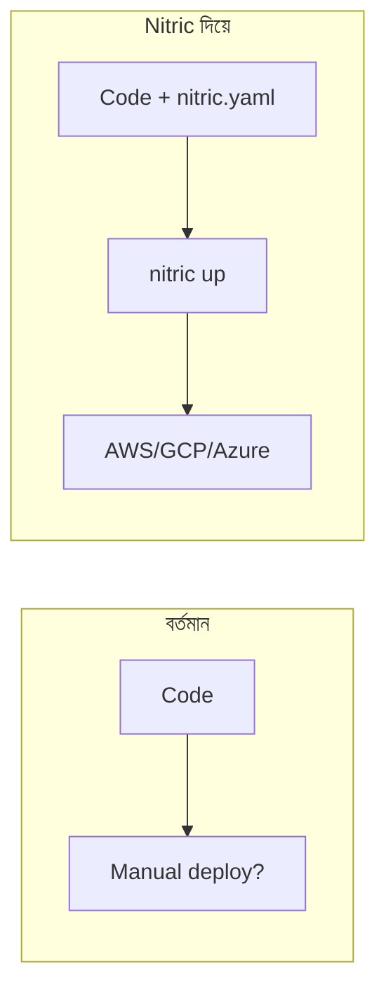

# Nitric দিয়ে Innodemy Codebase-এ কী কী Benefit পাওয়া যাবে

## আপনার বর্তমান Stack (সংক্ষিপ্ত)


| Component  | Technology                              |
| ---------- | --------------------------------------- |
| Backend    | NestJS 11 + Fastify                     |
| Database   | Prisma + Neon PostgreSQL                |
| Cache      | In-memory (Redis পরিকল্পিত)             |
| Storage    | Cloudinary (payment slips, screenshots) |
| Email      | Nodemailer (Gmail SMTP)                 |
| Deployment | নেই (Dockerfile/compose অনুপস্থিত)      |


---

## Nitric কী দেয়

[Nitric](https://nitric.io/) হলো **Infrastructure from Code** framework। আপনার application code থেকেই API, bucket, queue, key-value store ইত্যাদি define করলে Nitric সেগুলো deploy করে দেয়।

### Nitric-এর মূল সুবিধা

1. **Cloud portability** – একই code AWS, GCP, Azure-এ deploy করা যায়
2. **Deployment automation** – `nitric up` দিয়ে deploy, আলাদা Terraform/Pulumi লেখার দরকার কম
3. **Local development** – `nitric start` দিয়ে local-এ API, bucket, queue ইত্যাদি emulate করা যায়
4. **NestJS support** – [Official NestJS integration](https://nitric.io/docs/guides/nodejs/nestjs) আছে

---

## Innodemy-তে Nitric দিয়ে কী কী benefit পাবেন

### 1. Deployment automation (সবচেয়ে বড় benefit)

বর্তমানে আপনার repo-তে Dockerfile বা deployment config নেই। Nitric দিয়ে:

- `nitric.yaml` + stack file দিয়ে deployment define করা যায়
- `nitric up` দিয়ে AWS/GCP/Azure-এ deploy করা যায়
- Pulumi/Terraform-এর জন্য IaC generate করা যায়




### 2. File storage (Bucket) – Cloudinary বিকল্প

Payment slips, enrollment screenshots ইত্যাদির জন্য Nitric bucket ব্যবহার করা যায়:

```typescript
// Nitric bucket - cloud-agnostic
const uploads = bucket('payment-slips').allow('read', 'write');
await uploads.file(filename).write(buffer);
```

- Cloud-agnostic: AWS S3, GCP Storage, Azure Blob সব জায়গায় কাজ করবে
- Cloudinary থেকে সরিয়ে Nitric bucket-এ migrate করা যায় (যদি চান)

### 3. Cache (Key-Value store) – Redis বিকল্প

আপনার `CacheService` এখন in-memory। Nitric KV store দিয়ে:

```typescript
const cache = kv('app-cache').allow('get', 'set', 'delete');
await cache.set('key', value);
const data = await cache.get('key');
```

- Local-এ Nitric emulator, production-এ cloud-native cache
- Redis আলাদা setup করার দরকার কমে যায়

### 4. Background jobs (Queue)

Cron jobs (যেমন `node-cron`) এর বদলে Nitric queue ব্যবহার করা যায়:

```typescript
const tasks = queue('tasks').allow('enqueue', 'dequeue');
await tasks.enqueue({ type: 'send-email', payload: {...} });
```

- Serverless-friendly
- Scale automatically

### 5. Local development

`nitric start` চালালে:

- API, bucket, queue, KV store সব local-এ emulate হয়
- Dashboard দিয়ে resources দেখা যায়
- Wifi ছাড়াই local development সম্ভব

---

## বিবেচ্য বিষয় (Trade-offs)

### 1. Prisma + Neon

- Nitric database resource সরাসরি দেয় না
- Prisma + Neon দিয়েই থাকবেন, Nitric এখানে পরিবর্তন করবে না
- Nitric মূলত API, storage, cache, queue ইত্যাদির জন্য

### 2. Migration effort

- বর্তমান NestJS app-কে Nitric-এর সাথে integrate করতে হবে
- `main.ts`-এ `http(bootstrap)` wrapper লাগবে
- নতুন resources (bucket, KV, queue) adopt করতে হলে code change দরকার

### 3. Existing services

- Cloudinary, Resend, Nodemailer ইত্যাদি Nitric দিয়ে replace করা বাধ্যতামূলক না
- Nitric-এর “escape hatch” দিয়ে existing SDK (যেমন Cloudinary) ব্যবহার করা যায়

### 4. Learning curve

- `nitric.yaml`, stack files, provider config শিখতে হবে
- Local emulator এবং production deploy flow বুঝতে হবে

---

## সুপারিশ


| Scenario                              | সুপারিশ                                                                      |
| ------------------------------------- | ---------------------------------------------------------------------------- |
| শুধু deployment automation চাই        | Nitric দিয়ে `nitric.yaml` + stack setup করুন, `nitric up` দিয়ে deploy করুন |
| Redis/cache চাই                       | Nitric KV store ব্যবহার করুন                                                 |
| File upload নিজে handle করতে চাই      | Nitric bucket ব্যবহার করুন (Cloudinary বিকল্প)                               |
| Background jobs serverless চাই        | Nitric queue ব্যবহার করুন                                                    |
| সবকিছুই ঠিক আছে, শুধু deploy করতে হবে | Vercel/Railway/Render ইত্যাদি সহজ বিকল্পও আছে                                |


---

## পরবর্তী পদক্ষেপ (যদি Nitric adopt করেন)

1. `@nitric/sdk` install করা
2. [innodemy-backend](e:\Innodemy\innodemy-backend) root-এ `nitric.yaml` তৈরি করা
3. `main.ts`-এ `http(bootstrap)` wrapper যোগ করা
4. `nitric stack new dev aws` (বা gcp/azure) দিয়ে stack তৈরি করা
5. `nitric up` দিয়ে deploy করা

আরও বিস্তারিত: [Nitric NestJS Guide](https://nitric.io/docs/guides/nodejs/nestjs), [Nitric Docs](https://nitric.io/docs)